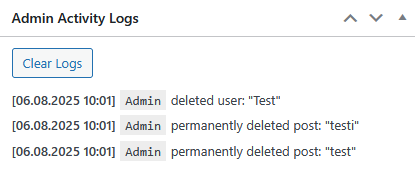
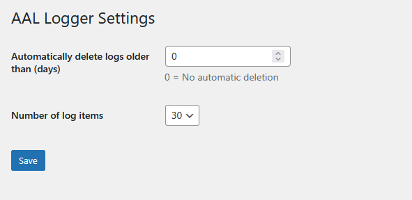

# Admin Activity Logger Lite

A lightweight WordPress plugin that logs key admin activities like post changes, media deletions, and user actions. Includes auto-purge and manual log clearing.

---

## Features

- Logs when posts are published, updated, moved to trash, or deleted permanently  
- Logs user creation, role changes, and deletions  
- Logs media file permanent deletions  
- Clean and readable dashboard widget for recent admin actions  
- Manual log clearing with confirmation  
- Auto-purge logs older than configurable number of days  

---

## What does it log?

- 📄 When a new post is published  
- 🗑️ When a post is moved to trash  
- ❌ When a post is permanently deleted  
- ✏️ When a post is updated  
- 👤 When a new user is created or their role changes  
- 🚫 When a user is deleted  
- 🖼️ When a media file is permanently deleted  

---

## FAQ

**Is this plugin GDPR compliant?**  
Yes. The plugin only logs admin-side actions and does not track frontend user activity.

**Where are logs stored?**  
Logs are stored in a dedicated database table: `aal_logs`.

**Can I clear the logs manually?**  
Yes, via the "Clear Logs" button with confirmation prompt.

**How does auto-purge work?**  
You can set retention days in settings. Logs older than that will be automatically deleted daily using WordPress cron.

---

## Installation

1. Upload the plugin files to the `/wp-content/plugins/admin-activity-logger-lite` directory, or install the plugin through the WordPress plugins screen directly.  
2. Activate the plugin through the 'Plugins' screen in WordPress.  
3. Configure settings via **Settings > AAL Logger**.

---

## Screenshots

  
*Dashboard widget showing recent admin actions.*

  
*Settings page with log retention and item count options.*

---

## Changelog

### 1.0.0
- Initial release with logging for posts, users, and media actions  
- Manual log clearing  
